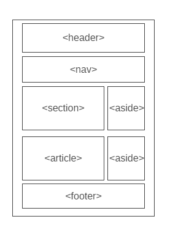

# Development Strategy

> `Group work: building a website`

A basic web page with semantic layout, developed collaboratively using branches.  It's not very interesting to look at.

## Wireframe

## 0. Set-Up

__A User can see my initial repository and live demo__

### Repository

1. Created a new repository [generated](https://github.blog/2019-06-06-generate-new-repositories-with-repository-templates/) from [this template](https://github.com/hackyourfuturebelgium/w3-validation-template)
2. Clone the repository
3. Copy-paste the markdown from this file to the empty `development-strategy.md` file in the new repo
4. Add [this wireframe](./wireframe.gif) into your new repo
5. Start your README file
6. Push the changes
7. turn on GitHub Pages

---

## 1. title

__As a site visitor, I want to know what the web page is called__

> assigned to Alex

### Repository

1. This user story was developed locally by Alex on a brach called `header`.
2. The new branch was pushed to the shared repository
3. A pull request was made to `master` & reviewed by the team
4. Changes were merged to `master`

### HTML

- A header element with a title describing the web page

### CSS

- Layout styling for the header
- Text styling for the main title

---

## 2.  introduction

__As a site visitor, I want to read an introduction to this web page__

> assigned to Alex

### Repository

1. This user story was developed locally by Alex on a brach called `main section`.
2. The new branch was pushed to the shared repository
3. A pull request was made to `master` & reviewed by the team
4. Changes were merged to `master`

### HTML

- section element
- some nice text in the section introducing users to this web page

### CSS

Styling for the new element

---

## 3. main text

__As a site visitor, I want to learn about something cool__

> assigned to Nadia

### Repository

1. This user story was developed locally by Nadia on a brach called `main-text`.
2. The new branch was pushed to the shared repository
3. A pull request was made to `master` & reviewed by the team
4. Changes were merged to `master`

### HTML

- article element
- something cool that everyone needs to know

### CSS

Styling for the new element

---

## 4. references

__As a site visitor, I want to know where I can learn more__

> assigned to Nadia

### Repository

1. This user story was developed locally by Nadia on a brach called `references`.
2. The new branch was pushed to the shared repository
3. A pull request was made to `master` & reviewed by the team
4. Changes were merged to `master`

### HTML

- aside element
- some links for people to learn more about the cool thing

### CSS

Styling for the new element

---

## 5. footer

__As a site visitor, I want to know who is the author of the page__

> assigned to Nadia

### Repository

1. This user story was developed locally by Nadia on a brach called `footer` and `create-footer`.
2. The new branch was pushed to the shared repository
3. A pull request was made to `master` & reviewed by the team
4. Changes were merged to `master`

### HTML

- footer element with copyright text

### CSS

- Layout styling for the footer
- Text styling for the footer

---

## 6. page navigation

__As a site visitor, I want to navigate easily throughout the website__

> assigned to Alex

### Repository

1. This user story was developed locally by Alex on a brach called `nav-bar`.
2. The new branch was pushed to the shared repository
3. A pull request was made to `master` & reviewed by the team
4. Changes were merged to `master`

### HTML

- nav element with About, Home and Contact links

### CSS

- Styling for the new element
- Text styling for the nav
- state styling for the nav links

---

## 7. Finishing Touches

__As a perfectionist, I want everything perfect :)__

- Write final, complete README:
  - [makeareadme.com](https://www.makeareadme.com/)
  - [bulldogjob](https://bulldogjob.com/news/449-how-to-write-a-good-readme-for-your-github-project)
  - [meakaakka](https://medium.com/@meakaakka/a-beginners-guide-to-writing-a-kickass-readme-7ac01da88ab3)
- Check for styling errors with a linter & prettify code
- Validate source code on w3 to check for any last mistakes
